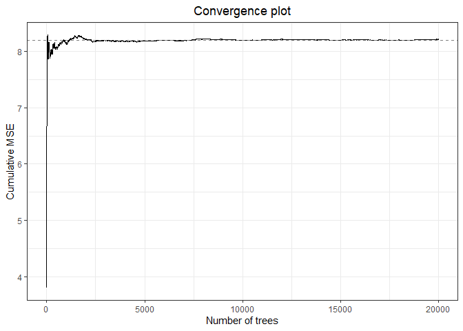

Untitled
================
21 July, 2020

## Multicolinearity analysis

``` r
library(worcs)
library(readxl)
library(tidySEM)
```

    ## Warning: package 'tidySEM' was built under R version 4.0.2

``` r
library(metaforest)
```

    ## Warning: package 'ggplot2' was built under R version 4.0.2

``` r
# Email from Xavier:
# The dataset has 2 sheets. In sheet #1 you will find the data to be analysed and in sheet #2 the description of the study variables.
load_data()
```

    ## v  Loading original data from 'data.csv'.

``` r
dictionary <- read.csv("../dictionary.csv", stringsAsFactors = FALSE)

dictionary <- dictionary[!is.na(dictionary$Meaning), 1:2]
dictionary <- dictionary[-c(6,30), ]

# Patient-related covariates: mean age, gender (% of men), illness severity at baseline, previous treatment (treatment naïve), ethnicity (% Caucasian).
#dictionary[7:10, ]
mod_patient <- c(`Mean age` = "mean_age_1",
                 `Male (p)` = "men_1_imputed",
                 `Severity at baseline` = "mean_adhd1_baseline_t_imputed",
                 `Treatment naïve` = "naive_an_crit_incl",
                 `Ethnicity` = "white_1_imputed")


# Intervention related covariates: type of drug, concomitant psychotherapy, legal status of the drug (approved vs non approved (= investigational); approved for ADHD vs non-approved for ADHD)
#dictionary[12:14, ]
mod_intervention <-  c(`Stimulant` = "stimulant_investigated",
                       `Therapy` = "psychother_c",
                       `Approved` = "approved_adhd")

# Study design related covariates: study design (parallel vs cross-over), number of sites (or number of patients per study site or sample size), drug dosage (fixed versus variable), RCT duration, number of study arms, comorbidity as an inclusion criterion, proportion of patients assigned to placebo/probability of receiving placebo, duration of wash-out, % dropouts in the placebo arm, type of analysis (ITT: Yes/No).
#dictionary[16:23, ]
mod_design <- c(`Study design` = "parall_dis",
                `Sites` = "num_centers_imputed",
                `Drug dosage` = "fixed_dosification_imputed",
                `RCT duration` = "length_treat2",
                `Placebo (p)` = "prob_pbo",
                `Comorbidity` = "comorb_incl_crit",
                `ITT analysis` = "itt_analyisis"
)

# Other: Publication year, region (USA/others), sponsorship.
# Risk of bias: High risk of bias using the Cochrane risk of bias tool (Yes/No).
#dictionary[16:23, ]
#data$year <- as.numeric(format(data$publication_date, format = "%Y"))
data$year <- as.numeric(substring(data$publication_date, 1, 4))
mod_other <- c(`Year` = "year",
               `USA` = "usa",
               `Sponsorship` = "pharm_ind_main",
               `Risk of bias` = "high_rob")

mods <- c(mod_patient,
          mod_intervention,
          mod_design,
          mod_other
)


# Code factors
desc <- descriptives(data)
is_factor <- desc$unique == 2 & sapply(data, function(x){all(x %in% c(0,1))})
data[is_factor] <- lapply(data[is_factor], factor)

# Covariates with more than 50% of missing data will be removed.

# According to the protocol, now you should:
#   1.  examine multicollinearity, using the generalized VIF (https://github.com/cjvanlissa/metafor/blob/master/R/vif.rma.r). 

dat <- escalc(measure = "MN", mi = data$mean_adhd1_change_1, sdi = data$sd_adhd1_change_1_imputed, ni = data$n_adhd1_change_1, data = data[mods])

res <- rma(yi = dat$yi,
           vi = dat$vi,
           mods = model.matrix(~., data[mods])[,-1])
vifs <- vif(res)
write.csv(vifs, "vif.csv")
worcs:::write_gitig(".gitignore", "!vif.csv")


# Please, let us know what are the findings of this analysis. If no collinearity is found, the next steps will be splitting the sample in two and carrygin out the metaregression/metaforest analyses using the training data set.
```

We examined multicolinearity by running a random effects meta-analysis
with all predictors included, and computing the generalized VIF. Values
ranged from \([1.26, 3.27]\), thus indicating no evidence of
multicolinearity.

## Split training/testing sample

Subsequently, we split the data into a training and testing sample,
using the preregistered seed value.

``` r
set.seed(4286)
train <- sample(unique(data$id), size = .7*length(unique(data$id)), replace = FALSE)
df_train <- dat[data$id %in% train, ]
df_test <- dat[!data$id %in% train, ]
```

The training data had 65 cases, and the testing data had 29 cases.

## Metaforest model

To build a metaforest model, we first conducted an analysis with random
effects weights and default settings, with 20000 iterations to determine
the number of trees required to reach convergence.

``` r
# Run model with many trees to check convergence
check_conv <- MetaForest(yi~.,
                        data = df_train,
                        whichweights = "random",
                        num.trees = 20000)
# Plot convergence trajectory
```



It can be seen that this model has converged within approximately 10000
trees (Figure @ref(fig:figconverge)). Thus, we will use this number of
trees for subsequent analyses. We now apply pre-selection using the 
function. This algorithm helps eliminate noise moderators by replicating
the analysis 100-fold. Using \\texttt{preselect\_vars}, we retain only
those moderators for which a 95% percentile interval of the variable
importance metrics does not include zero (variable importance is counted
as zero when a moderator is not included in the final step of the
recursive algorithm).

``` r
if(run_everything){
  # Model with 10000 trees for replication
mf_rep <- MetaForest(yi~.,
                        data = df_train,
                        whichweights = "random",
                        num.trees = 10000)
# Run recursive preselection, store results in object 'preselect'
preselected <- preselect(mf_rep,
                         replications = 100)
# Plot the results
plot(preselected)
# Retain only moderators with positive variable importance in more than
# 50% of replications
retain_mods <- preselect_vars(preselected, cutoff = .95)
yaml::write_yaml(retain_mods, "retain_mods.txt")
} else {
  retain_mods <- yaml::read_yaml("retain_mods.txt")
}
```

``` r
# Plot the results
plot(preselected)
```

Next, we tune the model using the R-package , which offers a uniform
workflow for any machine learning task. The function
\\texttt{ModelInfo\_mf} tells caret how to tune a MetaForest analysis.
As tuning parameters, we consider all three types of weights (uniform,
fixed-, and random-effects), number of candidate variables at each split
from 2-6, and a minimum node size from 2-6. We select the model with
smallest prediction error (RMSE) as final model, based on 10-fold
clustered cross-validation. Clustered cross-validation means that effect
sizes from the same study are always included in the same fold, to
account for the dependency in the data. Note that the number of folds
cannot exceed the number of clusters in the data. Moreover, if the
number of clusters is very small, one might have to resort to specifying
the same number of folds as clusters. Model tuning typically takes a
long time; for this small dataset, it might take five minutes; for a
very large dataset, it might take hours. However, when your dataset is
larger, you will often reach model convergence at a lower number of
trees, which reduces computation time.

``` r
# Load the caret library
if(run_everything){
  library(caret)
# Set up 10-fold CV
cv_folds <- trainControl(method = "cv", 
                           index = createFolds(df_train$yi))

# Set up a tuning grid for the three tuning parameters of MetaForest
tuning_grid <- expand.grid(whichweights = c("random", "fixed", "unif"),
                       mtry = 2:6,
                       min.node.size = 2:6)

# X should contain only retained moderators, clustering variable, and vi
X <- df_train[, c("vi", mods)]

# Train the model
mf_cv <- train(y = df_train$yi,
               x = X,
               method = ModelInfo_mf(), 
               trControl = cv_folds,
               tuneGrid = tuning_grid,
               num.trees = 10000)
  saveRDS(mf_cv, "mf_cv.RData")
}
```

    ## Warning: package 'caret' was built under R version 4.0.2

    ## Loading required package: lattice

    ## Warning in nominalTrainWorkflow(x = x, y = y, wts = weights, info = trainInfo, :
    ## There were missing values in resampled performance measures.

``` r
mf_cv <- readRDS("mf_cv.RData")
best <- metaforest:::best(mf_cv)
# Extract R^2_{cv} for the optimal tuning parameters
r2_cv <- mf_cv$results$Rsquared[which.min(mf_cv$results$RMSE)]
```

Based on the root mean squared error, the best combination of tuning
parameters were uniform weights, with 4 candidate variables per split,
and a minimum of 2 cases per terminal node. We examined convergence of
the final model (Figure @ref(fig:figconvergetuned)). Then, we examine
the \(R^2_{oob}\).

``` r
# For convenience, extract final model
final <- mf_cv$finalModel
# Extract R^2_{oob} from the final model
r2_oob <- final$forest$r.squared
# Examine performance on testing set
test_performance <- model_accuracy(final, 
                                   newdata = data.frame(.outcome = df_test$yi, df_test[mods]),
                                   observed = df_test$yi,
                                   ymean = mean(df_train$yi))
```


``` r
# Plot variable importance
VarImpPlot(final)
```


``` r
ordered_vars <- names(final$forest$variable.importance)[
  order(final$forest$variable.importance, decreasing = TRUE)]
# Plot partial dependence
PartialDependence(final, vars = ordered_vars,
                  rawdata = TRUE, pi = .95)
```


We can conclude that the model has converged, and has a positive
estimate of explained variance in new data, \(R^2_{oob} = 0.33\),
\(R^2_{cv} = 0.11\). However, the model has negative explained variance
in the testing data, \(R^2_{test} = -0.04\). Thus, the model appears to
be overfit. We will plot the variable importance (Figure
@ref(fig:figvarimp)), and partial dependence plots (Figure
@ref(fig:figpd)).
